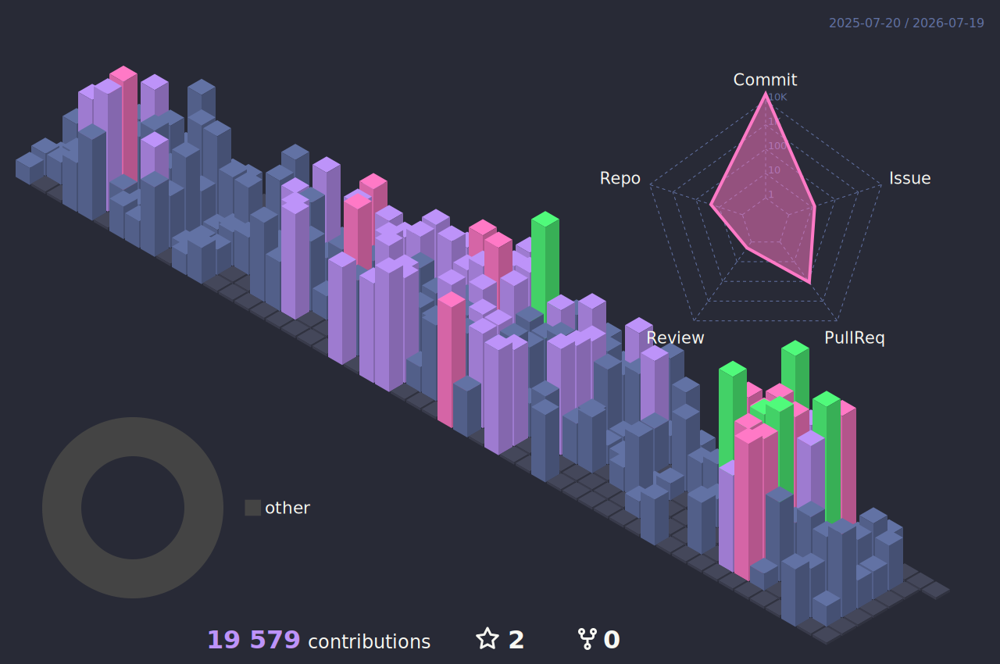

<!-- ═══════════════════════════════════════════════════════════════ -->
<!--                      🧛 DRACULA HEADER                        -->
<!-- ═══════════════════════════════════════════════════════════════ -->

 

<!-- Animated Neon Badges -->

  

  

 

 

<!-- ═══════════════════════════════════════════════════════════════ -->
<!--                       🧛 ABOUT ME                             -->
<!-- ═══════════════════════════════════════════════════════════════ -->

<h2 align="center">
  
  &nbsp;About Me&nbsp;
  
</h2>

 

**Full-Stack Engineer con 7+ años de experiencia construyendo productos digitales de alto impacto para empresas — apps en producción usadas por miles de usuarios reales.**

 

🚀 &nbsp;<b>190+ repositorios</b> | <b>20+ tecnologías dominadas</b> | <b>5,900+ contribuciones</b> 
🏢 &nbsp;Desarrollo de <b>productos enterprise-grade</b> en producción para compañías establecidas 
🧠 &nbsp;Apasionado por <b>Clean Architecture, DDD & SOLID</b> 
🤖 &nbsp;Building <b>AI Agents</b>, multi-agent orchestration & <b>MCP integrations</b> 
⚡ &nbsp;Expert in <b>prompt engineering</b>, LLM pipelines & AI-powered workflows 
🎓 &nbsp;Mentor de <b>30+ estudiantes</b> en bootcamps Full Stack 
📖 &nbsp;Always learning — currently diving into <b>Python & Cloud Architecture</b> 
🌎 &nbsp;Languages: <b>Spanish</b> (native) · <b>English</b> (learning) 
💬 &nbsp;Ask me about <b>NestJS, Next.js, React Native, System Design</b>

<!-- ═══════════════════════════════════════════════════════════════ -->
<!--                      🧛 TECH STACK                            -->
<!-- ═══════════════════════════════════════════════════════════════ -->

<h2 align="center">
  
  &nbsp;Tech Arsenal&nbsp;
  
</h2>

&nbsp;<b>🗣️ Languages</b>

 

&nbsp;<b>🎨 Frontend & Mobile</b>

 

&nbsp;<b>⚙️ Backend & APIs</b>

 

&nbsp;<b>🗄️ Databases & Cloud</b>

 

&nbsp;<b>🤖 AI & Automation</b>

 

&nbsp;<b>🧪 Testing</b>

 

&nbsp;<b>🛠️ DevOps & Tools</b>

 

<!-- ═══════════════════════════════════════════════════════════════ -->
<!--                    🧛 CERTIFICATIONS                          -->
<!-- ═══════════════════════════════════════════════════════════════ -->

<h2 align="center">
  
  &nbsp;Certificaciones&nbsp;
  
</h2>

 

<b>🎓 Certificaciones con Vista Previa (imágenes) — Click para expandir</b>

 

<table>
<tr>
<td align="center"></td>
<td align="center"></td>
<td align="center"></td>
</tr>
<tr>
<td align="center"></td>
<td align="center"></td>
<td align="center"></td>
</tr>
<tr>
<td align="center"></td>
<td align="center"></td>
<td align="center"></td>
</tr>
<tr>
<td align="center"></td>
<td align="center"></td>
<td align="center"></td>
</tr>
<tr>
<td align="center"></td>
<td align="center"></td>
<td align="center"></td>
</tr>
</table>

<b>📄 Certificaciones PDF (Udemy) — Click para expandir</b>

 

|  #  |                                            Certificado                                            |                                                       Link                                                       |
| :-: | :-----------------------------------------------------------------------------------------------: | :--------------------------------------------------------------------------------------------------------------: |
|  1  |  | [📄 Ver Certificado](https://udemy-certificate.s3.amazonaws.com/pdf/UC-71159d27-3038-41f2-8712-9c83c0d2fa36.pdf) |
|  2  |  | [📄 Ver Certificado](https://udemy-certificate.s3.amazonaws.com/pdf/UC-887194f3-c135-4f03-a094-dec8f7acd831.pdf) |
|  3  |  | [📄 Ver Certificado](https://udemy-certificate.s3.amazonaws.com/pdf/UC-ba93e0ec-bd63-4123-9371-1f54a86fda81.pdf) |
|  4  |  | [📄 Ver Certificado](https://udemy-certificate.s3.amazonaws.com/pdf/UC-2f72d31e-5989-4f5b-8853-7cf7fd6a0007.pdf) |
|  5  |  | [📄 Ver Certificado](https://udemy-certificate.s3.amazonaws.com/pdf/UC-8ac43057-f130-4557-8332-41146c2949d0.pdf) |
|  6  |  | [📄 Ver Certificado](https://udemy-certificate.s3.amazonaws.com/pdf/UC-2450ea75-3e16-4dad-bdea-1ba179ec0f46.pdf) |
|  7  |  | [📄 Ver Certificado](https://udemy-certificate.s3.amazonaws.com/pdf/UC-779c347c-46c5-4095-a54e-d3298c674350.pdf) |
|  8  |  | [📄 Ver Certificado](https://udemy-certificate.s3.amazonaws.com/pdf/UC-992410e2-b065-468c-b194-f1834f9a577e.pdf) |
|  9  |  | [📄 Ver Certificado](https://udemy-certificate.s3.amazonaws.com/pdf/UC-822c864f-fb3e-422f-88b7-2a0daf804a87.pdf) |
| 10  |  | [📄 Ver Certificado](https://udemy-certificate.s3.amazonaws.com/pdf/UC-e066f3dd-a5a6-4448-ad7d-010e727fc985.pdf) |
| 11  |  | [📄 Ver Certificado](https://udemy-certificate.s3.amazonaws.com/pdf/UC-4bf8773f-d982-4ba3-b85b-59071db805cb.pdf) |
| 12  |  | [📄 Ver Certificado](https://udemy-certificate.s3.amazonaws.com/pdf/UC-999cb8a3-4efa-439d-85fe-f2f754005557.pdf) |
| 13  |  | [📄 Ver Certificado](https://udemy-certificate.s3.amazonaws.com/pdf/UC-b2b685bc-e3cc-4526-aada-7f7fc014d789.pdf) |
| 14  |  | [📄 Ver Certificado](https://udemy-certificate.s3.amazonaws.com/pdf/UC-9ecc0cd3-1963-4f9c-87df-3da6bcc1d378.pdf) |
| 15  |  | [📄 Ver Certificado](https://udemy-certificate.s3.amazonaws.com/pdf/UC-a3b7145b-de8a-4b17-ae8e-421af4600279.pdf) |
| 16  |  | [📄 Ver Certificado](https://udemy-certificate.s3.amazonaws.com/pdf/UC-37c4b311-29c5-4818-9914-c5b8b495ac8c.pdf) |
| 17  |  | [📄 Ver Certificado](https://udemy-certificate.s3.amazonaws.com/pdf/UC-685fc082-2d57-4f6c-9183-73a749b78b64.pdf) |
| 18  |  | [📄 Ver Certificado](https://udemy-certificate.s3.amazonaws.com/pdf/UC-62d89a10-02f5-42bd-9173-126268feacdb.pdf) |
| 19  |  | [📄 Ver Certificado](https://udemy-certificate.s3.amazonaws.com/pdf/UC-3c66aa61-6ca0-4538-99b3-5b4e6e5b44be.pdf) |
| 20  |  | [📄 Ver Certificado](https://udemy-certificate.s3.amazonaws.com/pdf/UC-aa4304ef-ccee-4927-bef0-f887b1754685.pdf) |

<b>🚀 Certificaciones DevTalles — Click para expandir</b>

 

|  #  |                                                  Plataforma                                                   |                                    Link                                    |
| :-: | :-----------------------------------------------------------------------------------------------------------: | :------------------------------------------------------------------------: |
|  1  |  | [🎓 Ver Certificado](https://cursos.devtalles.com/certificates/vq6skylywa) |
|  2  |  | [🎓 Ver Certificado](https://cursos.devtalles.com/certificates/2pxghejbg4) |
|  3  |  | [🎓 Ver Certificado](https://cursos.devtalles.com/certificates/puokbdneuy) |
|  4  |  | [🎓 Ver Certificado](https://cursos.devtalles.com/certificates/pinjd1dtv1) |
|  5  |  | [🎓 Ver Certificado](https://cursos.devtalles.com/certificates/vqkxytr10b) |

 

<!-- ═══════════════════════════════════════════════════════════════ -->
<!--                    🧛 GITHUB STATS                            -->
<!-- ═══════════════════════════════════════════════════════════════ -->

<h2 align="center">
  
  &nbsp;GitHub Analytics&nbsp;
  
</h2>

<!-- Streak Stats -->

  

<!-- GitHub Stats + Top Languages side by side -->

&nbsp;&nbsp;

<!-- ═══════════════════════════════════════════════════════════════ -->
<!--                    🧛 TROPHY SHELF                            -->
<!-- ═══════════════════════════════════════════════════════════════ -->

<h2 align="center">
  
  &nbsp;Achievement Trophy Shelf&nbsp;
  
</h2>

<!-- ═══════════════════════════════════════════════════════════════ -->
<!--                    🧛 ACTIVITY GRAPH                          -->
<!-- ═══════════════════════════════════════════════════════════════ -->

<h2 align="center">
  
  &nbsp;Contribution Activity&nbsp;
  
</h2>

<!-- ═══════════════════════════════════════════════════════════════ -->
<!--                    3D CONTRIBUTION GRAPH                      -->
<!-- ═══════════════════════════════════════════════════════════════ -->

<h2 align="center">
  
  &nbsp;3D Contribution Skyline&nbsp;
  
</h2>

<picture>
  <source media="(prefers-color-scheme: dark)" srcset="./profile-3d-contrib/profile-dracula-rainbow.svg" />
  <source media="(prefers-color-scheme: light)" srcset="./profile-3d-contrib/profile-dracula.svg" />
  
</picture>

<!-- ═══════════════════════════════════════════════════════════════ -->
<!--                    CODING ACTIVITY (WAKATIME)                 -->
<!-- ═══════════════════════════════════════════════════════════════ -->

<h2 align="center">
  
  &nbsp;Coding Activity&nbsp;
  
</h2>

 

 

<!-- WakaTime details shown via badges above -->

<!-- ═══════════════════════════════════════════════════════════════ -->
<!--                    🧛 PROFILE VIEWS                           -->
<!-- ═══════════════════════════════════════════════════════════════ -->

  

<!-- ═══════════════════════════════════════════════════════════════ -->
<!--                    🧛 SPOTIFY                                 -->
<!-- ═══════════════════════════════════════════════════════════════ -->

<h2 align="center">
  
  &nbsp;Now Playing&nbsp;
  
</h2>

 

 

**⭐ From [runyshark](https://github.com/runyshark) with 💜**

<!-- ═══════════════════════════════════════════════════════════════ -->
<!--                    🧛 SNAKE                                   -->
<!-- ═══════════════════════════════════════════════════════════════ -->
<!-- 🐍 SNAKE SETUP: Create .github/workflows/snake.yml in your    -->
<!-- runyshark/runyshark profile repo with:                        -->
<!--                                                               -->
<!-- name: Generate Snake                                          -->
<!-- on:                                                           -->
<!--   schedule:                                                   -->
<!--     - cron: "0 0 * * *"                                       -->
<!--   workflow_dispatch:                                           -->
<!-- jobs:                                                          -->
<!--   build:                                                      -->
<!--     runs-on: ubuntu-latest                                    -->
<!--     steps:                                                    -->
<!--       - uses: Platane/snk@v3                                  -->
<!--         with:                                                 -->
<!--           github_user_name: runyshark                         -->
<!--           outputs: |                                          -->
<!--             dist/github-snake.svg                             -->
<!--             dist/github-snake-dark.svg?palette=github-dark    -->
<!--       - uses: crazy-max/ghaction-github-pages@v3              -->
<!--         with:                                                 -->
<!--           target_branch: output                               -->
<!--           build_dir: dist                                     -->
<!--         env:                                                  -->
<!--           GITHUB_TOKEN: ${{ secrets.GITHUB_TOKEN }}            -->
<!-- ═══════════════════════════════════════════════════════════════ -->

<picture>
  <source media="(prefers-color-scheme: dark)" srcset="https://raw.githubusercontent.com/runyshark/runyshark/output/github-snake-dark.svg" />
  <source media="(prefers-color-scheme: light)" srcset="https://raw.githubusercontent.com/runyshark/runyshark/output/github-snake.svg" />
  
</picture>

<!-- ═══════════════════════════════════════════════════════════════ -->
<!--                    🧛 FOOTER                                  -->
<!-- ═══════════════════════════════════════════════════════════════ -->

